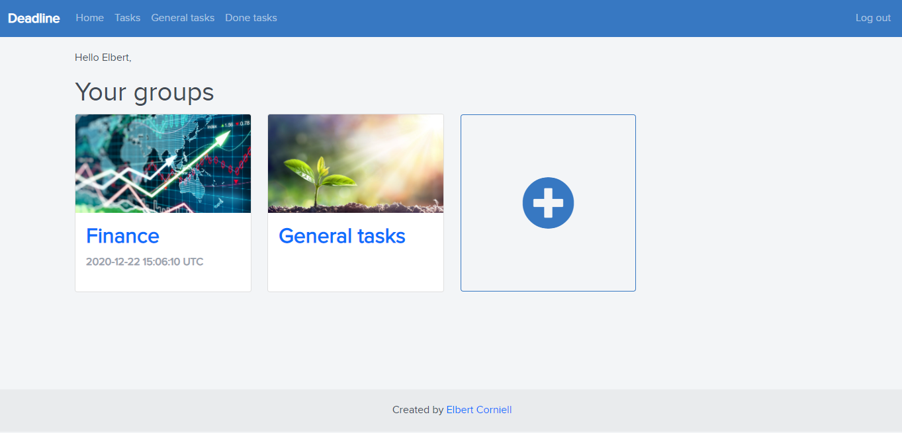
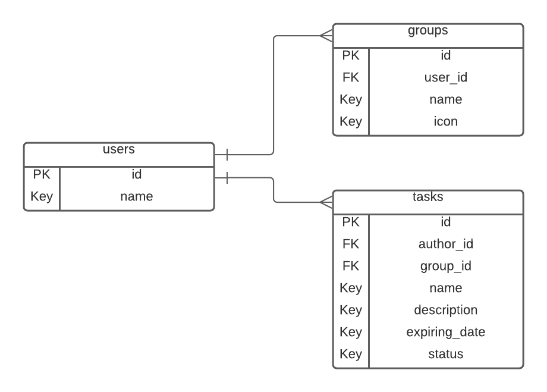

# Deadline - An opensource task manager
A task manager for everything you can imagine with the ability of creating task groups for specific events or areas of your life and deadlines for each task. Build using Ruby on Rails and Bootstrap.

 <br>

## Built With 

- Ruby v2.7.0
- Ruby on Rails v5.2.4

## Live Demo

[Heroku Live Demo](https://quiet-falls-29973.herokuapp.com/)

## Video Demo

[Task Manager Video Demo](https://www.loom.com/share/c5db354ab7bb4777a0fdbd6f3c09088d)
[Task Manager Video Demo Updates](https://www.loom.com/share/bc7a8f6bfe1d4b209b73dfd3947beef5)

## Getting Started

To get a local copy up and running follow these simple steps:

### Prerequisites

Ruby: 2.6.3
Rails: 5.2.3
Postgres: >=9.5

### Setup

Clone the repository:

```
    git clone https://github.com/elberthcorniell/task-manager-ror.git
```

Open the repo folder:

```
    cd task-manager-ror
```

Instal gems with:

```
    bundle install
```

Setup database with:

```
   rails db:create
   rails db:migrate
```

Entity Relationship Diagram of the database setted in the last step:

 

### Usage

Start server with:

```
    rails server
```

Open `http://localhost:3000/` in your browser.

### Run tests

For testing please escute the next steps:

- Execute the following code on the terminal to get the Gems needed:

```
    bundle install
```

- Make sure to have the testing database running:

```
    rails db:create db:migrate RAILS_ENV=test
```

- Run the test with the following command:

```
    rpsec --format documentation
```

## Authors

👤 **Elbert Corniel**

- GitHub: [@elberthcorniell](https://github.com/elberthcorniell)
- Twitter: [@elberthcorniell](https://twitter.com/elberthcorniell)
- LinkedIn: [Elbert Corniell](https://www.linkedin.com/in/elberthcorniell)

## 🤝 Contributing

Contributions, issues and feature requests are welcome!

Feel free to check the [issues page](issues/).

## Show your support

Give a ⭐️ if you like this project!

## Acknowledgments

- [Gregoire Vella on Behance](https://www.behance.net/gallery/19759151/Snapscan-iOs-design-and-branding)

## 📝 License

[MIT](./LICENSE)
